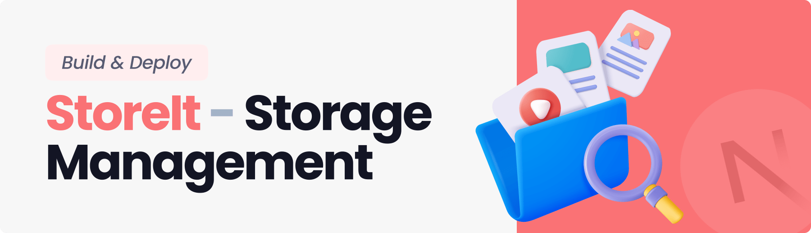

   
    
   

  

     
    
    
    
  

<h3 align="center">Storage and File Sharing Platform</h3>

A storage management and file sharing platform that lets users effortlessly upload, organize, and share files. Built with the latest Next.js 15 and the Appwrite Node SDK, utilizing advanced features for seamless file management.

